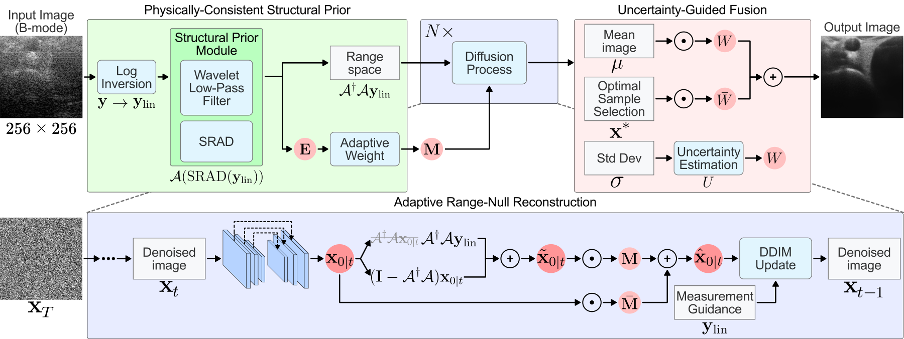

<p align="center">
  <font size="5"><b>UGNS: Uncertainty-Guided Null-Space Diffusion</b></font>
</p>

# UGNS: Null-Space Diffusion Restoration with Adaptive Uncertainty-Guided Fusion for Ultrasound Speckle Reduction

<p align="center">
  <a href="https://github.com/yousirong/UGNS"></a>
  <a href="LICENSE"></a>
  <a href="#-paper"></a>
</p>

## 🔥 News

- **August 7, 2026**: 🎉 Code released.

> The publisher link and DOI will be added here once the IEEE record is public.

---

## 📄 Paper

**Null-Space Diffusion Restoration with Adaptive Uncertainty-Guided Fusion for Ultrasound Speckle Reduction**
Juneyong Lee, Jaeyoung Choi (Member, IEEE) — IEEE Access, 2026

Department of Computer Science and Engineering, Hankuk University of Foreign Studies, Yongin-si 17035, Republic of Korea

UGNS suppresses speckle in B-mode ultrasound using an unconditional diffusion prior, without paired clean references. All quantitative results are reported in the paper; this repository provides the code to recompute them.

---

## 🧠 Overview

<p align="center">
  
</p>

*Overview of the proposed UGNS framework. The input B-mode image is first converted by log inversion to the stabilized positive-envelope proxy `y_lin`. In the Physically-Consistent Structural Prior, the Structural Prior Module combines SRAD and wavelet low-pass filtering to obtain the structural envelope `E` and the adaptive mask `M`. Adaptive Range-Null Reconstruction then combines the range-space observation with diffusion-generated null-space detail, followed by Measurement Guidance and a DDIM update. In Uncertainty-Guided Fusion, the ensemble mean `μ`, standard deviation `σ`, uncertainty map `U`, and representative sample `x*` are fused using `W` and `1-W` to produce the output.*

**Key features:**
- **Label-free**: the prior is pretrained on unlabeled ultrasound with a standard DDPM objective and deployed as-is, with no task-specific fine-tuning.
- **Envelope-domain consistency**: correction is applied to a stabilized positive-envelope proxy instead of the nonlinear log-compressed domain, so low-amplitude background is not disproportionately amplified.
- **System-matrix-free**: the range-null split is a wavelet transform of the beamformed image, so no acoustic system matrix or SVD is needed, and nothing has to be recomputed when the acquisition changes.

**Pipeline stages**

1. **Physically-consistent structural prior.** Inverse log compression with dynamic range `D = 60 dB` yields `y_lin`. SRAD followed by a wavelet low-pass operator `A` produces the structural envelope `E`, from which an adaptive reliability mask `M` is derived using center `c` and steepness `γ` plus an Otsu background gate.
2. **Adaptive range-null reconstruction.** At each reverse step the range space is anchored to the observation and the null space is regenerated by the diffusion prior, then blended by `M`. Cosine-scheduled measurement guidance and a deterministic DDIM update (`η = 0`) follow.
3. **Uncertainty-guided fusion.** An ensemble of `N` samples gives the posterior mean `μ` and predictive dispersion `σ`. A representative sample `x*` is selected, and the final image is a bounded convex combination of `μ` and `x*` whose mean weight stays within `[0.7, 0.98]`.

**Model**

The prior uses the guided-diffusion UNet backbone with base width 256 and channel multipliers `(1, 1, 2, 2, 4, 4)`. Multi-head attention is applied at 32×32, 16×16, and 8×8 resolutions. The diffusion process uses `T = 1000` steps with a linear noise schedule where beta increases from `1e-4` to `0.02`. The model operates on single-channel 256×256 inputs normalized to `[-1, 1]`.

The prior was trained on 5,929 unlabeled in vivo and in vitro ultrasound images spanning carotid cross-sectional and longitudinal views, CIRS phantom acquisitions, and additional multi-device images. Validation follows the PICMUS benchmark and the DRUS/DRUSvar evaluation protocol.

---

## ⚙️ Environment

- Python 3.10 or 3.11
- CUDA installation compatible with the pinned PyTorch build (`torch==2.3.0`)
- Reference profile: one NVIDIA RTX 4090 with 24 GB VRAM

Inference uses an ensemble and sampling batch of 10. Training preserves the paper's effective batch of 8 with micro-batch 2, four-step gradient accumulation, and activation checkpointing. The code warns before inference on smaller CUDA devices and reports the peak allocation measured by each run. Reducing the inference batch changes the seeded ensemble; it is a memory fallback, not an equivalent performance knob.

Multi-GPU and DeepSpeed training are outside this core release.

---

## 🛠️ Setup

#### 1. Clone the repository

```shell
git clone https://github.com/yousirong/UGNS.git
cd UGNS
```

#### 2. Set up a Python virtual environment

```shell
python -m venv .venv
source .venv/bin/activate

python -m pip install --upgrade pip
python -m pip install -r requirements.txt
```

The OpenAI guided-diffusion backbone is vendored under `third_party/guided_diffusion` with its MIT license.

---

## 📦 Checkpoints

Model weights are not part of this repository. Inference expects a trained prior and the `config.json` written next to it by the training script:

```
checkpoints/
├── ugns_prior.pt
└── config.json
```

Set `UGNS_CHECKPOINT` and `UGNS_CONFIG` to use a different location. Training from scratch additionally expects a 256×256 unconditional guided-diffusion checkpoint at `UGNS_PRETRAINED`; pass `--use_pretrained False` to train without one.

---

## 📂 Data Preparation

PICMUS data are available from the official [Plane-wave Imaging Challenge in Medical UltraSound](https://www.creatis.insa-lyon.fr/Challenge/IEEE_IUS_2016/). The Stanford/Dahl carotid and phantom acquisitions and the [CUBDL resources](https://cubdl.jhu.edu/) retain their own access and licensing terms and are not redistributed here.

1. **Set the data roots** (honored by all scripts)

   ```shell
   export UGNS_DATA_ROOT=/path/to/ugns-data
   export UGNS_RESULTS_ROOT=/path/to/ugns-results
   export UGNS_MODELS_ROOT=/path/to/ugns-checkpoints
   ```

2. **Prepare PICMUS exports**

   ```shell
   python preprocessing/prepare_drusvar_picmus_all_result_new.py --help
   ```

---

## 🚀 Training

The diffusion prior is trained on a directory of 256×256 grayscale PNG images. The single-GPU launcher reads `UGNS_DATA_ROOT`, `UGNS_OUTPUT_DIR`, `UGNS_PRETRAINED`, and `GPU_ID`:

```shell
UGNS_DATA_ROOT=/path/to/data \
UGNS_OUTPUT_DIR=/path/to/train-output \
bash training/run_train.sh
```

The script logs `effective_batch = batch_size * grad_accum_steps` and refuses to train when it differs from 8 unless `--allow_batch_override` is explicitly passed. Optimizer, EMA, scheduler, clipping, checkpoint cadence, and `global_step` all advance on optimizer boundaries.

---

## 🔍 Inference

```shell
UGNS_INPUT_DIR=/path/to/picmus-images \
UGNS_OUTPUT_DIR=/path/to/ugns-output \
UGNS_CHECKPOINT=/path/to/ugns_prior.pt \
UGNS_CONFIG=/path/to/config.json \
bash inference/run_ugns.sh
```

`--preset paper` is the equation-aligned default. Explicit CLI options always override preset values. `--preset paper-repro` selects the historical as-run fusion and guidance settings for auditing old experiments.

---

## 📊 Evaluation

The evaluator uses first-party definitions of gCNR, CNR, SNR, contrast, and minus-6-dB resolution width. It contains normalized PICMUS EC, ER, SC, and SR ROI settings and accepts YAML ROI overrides.

```shell
python evaluation/calculate_ultrasound_metrics.py \
    /path/to/ugns-output \
    --output-dir /path/to/local-metrics
```

Generated CSV and JSON files are local artifacts and must not be committed.

---

## 🧾 Paper Configuration

`configs/ugns_paper.yaml` is the single source of truth for inference.

| Component | Paper reference | Setting |
|---|---:|---|
| DDIM sampling | Section IV-D | steps 100, Karras schedule, eta 0 |
| Ensemble | Algorithm 1 | N 10, batch 10 |
| Guidance | Eq. 13 | cosine, lambda 0.3 to 0 |
| Range-null weights | Eq. 12 | range 1, null 1 |
| Low-pass operator | Eq. 12 | wavelet `sym4`, level 3 |
| Structural prior | Eq. 10 | SRAD on, 15 iterations, q0 0.4, delta-t 0.25 |
| Adaptive mask | Eq. 8–9 | dynamic range 60, c 0.4, gamma 3.5, Otsu gate on |
| Fusion | Eq. 19–21 | mean weight bounded to 0.7–0.98 |

---

## 📖 BibTeX

If you find this work useful, please cite it. See [`CITATION.cff`](CITATION.cff) for the machine-readable form.

```bibtex
@article{lee2026ugns,
  title   = {Null-Space Diffusion Restoration with Adaptive Uncertainty-Guided
             Fusion for Ultrasound Speckle Reduction},
  author  = {Lee, Juneyong and Choi, Jaeyoung},
  journal = {IEEE Access},
  year    = {2026}
}
```

Volume, issue, page, and DOI fields will be completed once the IEEE record is published.

---

## 📜 License and Acknowledgments

First-party UGNS code and documentation are released under [CC BY 4.0](LICENSE); please cite the paper when you use them. The vendored guided-diffusion backbone keeps its own [MIT license](third_party/guided_diffusion/LICENSE), Copyright (c) 2021 OpenAI.

UGNS builds on OpenAI guided-diffusion and acknowledges the CUBDL, PICMUS, DRUS, and DRUSvar projects and their respective authors. Datasets, model weights, and third-party code remain subject to their original terms.
